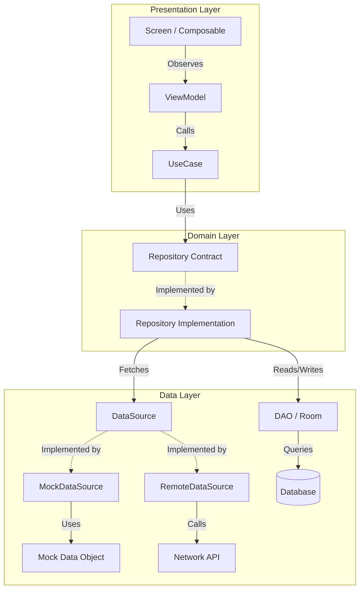

# Project Structure

```yaml
it.attendance100.mybicocca
├── components/
│
├── data/
│   ├── daos/
│   │   ├── Converters.kt                    # Room type converters
│   │   └── XDao.kt                          # DB access for X
│   │
│   ├── datasources/
│   │   └── x/
│   │       ├── XDataSource.kt               # Abstraction for X retrieval
│   │       ├── MockXDataSource.kt           # Mock X source
│   │       └── RemoteXDataSource.kt         # Network X source
│   │
│   ├── entities/
│   │   └── XEntity.kt                       # Room entity for X
│   │
│   ├── repository/
│   │   └── XRepository.kt                   # Implements X contract, uses DAOs + datasource
│   │
│   └── mocks/
│       └── XMockData.kt                     # Static mock data used by mock data sources
│
├── di/
│   ├── AppDatabase.kt                       # Room database configuration
│   ├── DatabaseModule.kt                    # Provides Room database instances
│   ├── DataSourceModule.kt                  # Chooses which data source to inject
│   └── RepositoryModule.kt                  # Provides repository instances
│
├── domain/
│   ├── contracts/
│   │   └── XRepository.kt                   # X operations contract
│   │
│   ├── model/
│   │   └── X.kt                             # X business model
│   │
│   └── usecase/
│       └── XUseCases.kt                     # X business logic entry points
│
├── screens/
│
├── ui/
│
├── utils/
│   ├── Animations.kt
│   ├── XUtils.kt                            # X-specific helper functions
│   ├── Locales.kt
│   └── PreferencesManager.kt
│
├── viewmodel/
│   └── XViewModel.kt                        # State management for X screen
│
├── MainActivity.kt
└── MyBicoccaApplication.kt                  # Hilt application class
```

## Layer Responsibilities

### Domain Layer

Defines what the app does

- **contracts/**: Interfaces for data operations
- **model/**: Business objects
- **usecase/**: Business logic and workflows

### Data Layer

Implements contracts, orchestrates persistence and remote access

- **daos/**: Room DAOs
- **datasources/**: Raw data providers (remote/mock)
- **entities/**: Room entities
- **repository/**: Concrete implementations of domain contracts
- **mocks/**: Static mock data used by mock data sources

### DI Layer

Dependency injection configuration with Hilt

- Provides instances
- Binds implementations to interfaces
- Manages object lifecycle

### Presentation Layer

UI and state management

- **screens/**: Composable screens
- **viewmodel/**: State holders
- **components/**: Reusable UI components
- **ui/theme/**: Styling and theming

## Data Flow Diagram


