

# MyBicocca

### Your entire university. One app.

**MyBicocca** folds every digital service of the University of Milano‑Bicocca into a single,
fast, offline‑first Android app built with Jetpack Compose and Material 3 Expressive.

 

 

<table>
  <tr>
    <td align="center">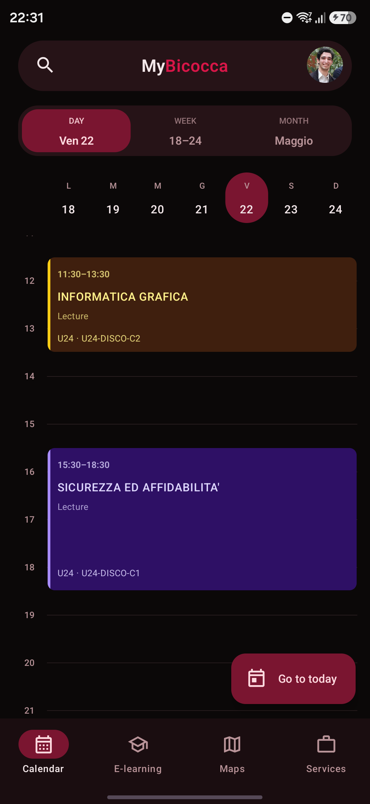</td>
    <td align="center">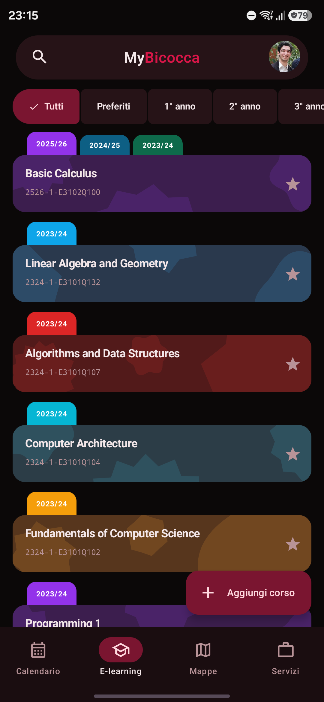</td>
    <td align="center">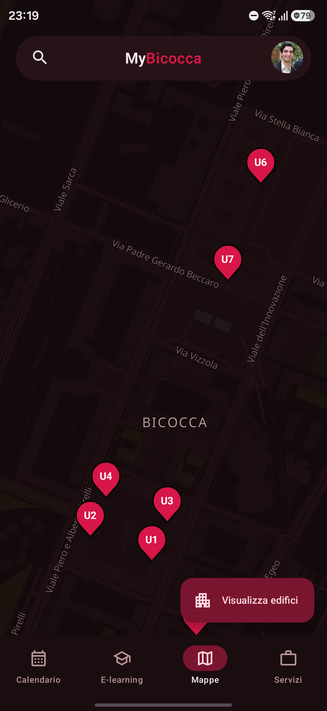</td>
    <td align="center">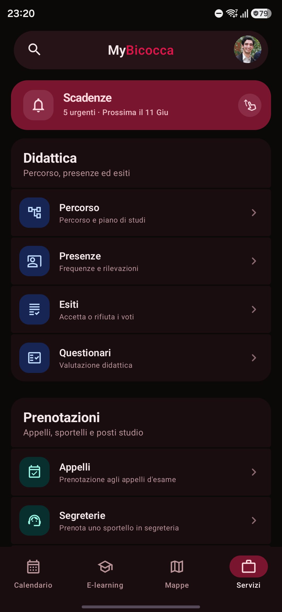</td>
    <td align="center">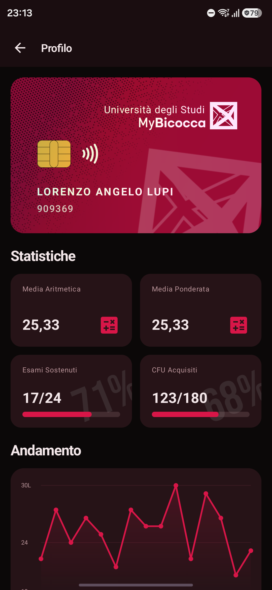</td>
  </tr>
</table>

---

## ⚖️ Disclaimer

MyBicocca is an **unofficial** application and is **not affiliated with the University of
Milano‑Bicocca**. It consumes publicly available APIs and web services of the platforms
it integrates. Please use it responsibly and in accordance with university policies.

---

## ✨ What is MyBicocca?

Bicocca students juggle a handful of disconnected web portals to get through the day:
one site to book an exam, another to read a lecture's slides, a third to check the
timetable, a fourth to reserve a seat in the library. **MyBicocca makes all of that a
single tab swipe away**, with a coherent design, a unified search, and data that's
cached on‑device so it's there even when the network isn't.
It is an **unofficial, student‑built** app. It speaks directly to the same services the
university already exposes, and consolidates them behind one native experience.

---

## 🔐 Privacy & security

**Your data stays yours.** MyBicocca talks to the university on your behalf and keeps the
results on your phone, nowhere else.

- 🔑 &nbsp;**Credentials encrypted on‑device**, never sent anywhere but the platforms they belong to
- 🔒 &nbsp;**HTTPS everywhere**, every request and every response
- 🙅 &nbsp;**Zero third‑party sharing**: no trackers, no analytics, no selling your data

---

## 📦 Installation

Download the latest signed APK from the [**GitHub Releases**](https://github.com/Auties00/MyBicocca/releases/latest)
page and install it on your Android device.

---

## 📅 Calendar

Your whole week at a glance. Lessons from EasyStaff, exams you've booked on Esse3,
Moodle assignment deadlines, Esse3 appointments and library reservations all
land on the same timeline, colour‑coded by source and pinch‑zoomable.

<table>
<tr>
<td></td>
<td>

#### Day

A pinch‑zoomable hourly timeline. Tap any block for the full detail and a deep link straight to the related course, assignment or library booking.

</td>
</tr>
<tr>
<td>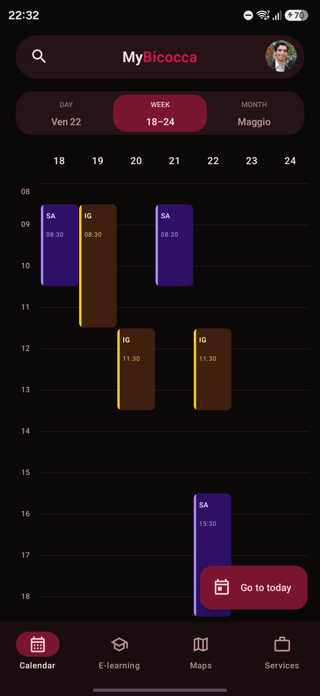</td>
<td>

#### Week

Seven days at a glance. The zoom level is shared with the Day view, so the density you choose follows you across both.

</td>
</tr>
<tr>
<td>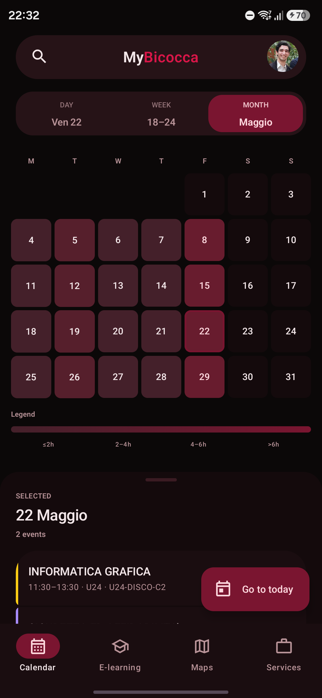</td>
<td>

#### Month

A heatmap tints each date by how busy it is, with a draggable agenda sheet for the day you tap. Pull down anywhere and every source re‑syncs without losing your place.

</td>
</tr>
</table>

---

## 🎓 E‑learning

A complete, native Moodle client, not a webview. Browse your courses, dive into
materials, hand in assignments, sit quizzes, follow forum threads and watch lecture
recordings, all inside the app.

<table>
<tr>
<td></td>
<td>

#### Your courses

Every enrolled course, grouped by academic period and filterable by year or favourites. An in‑app catalog browser lets you enrol in new ones on the spot.

</td>
</tr>
<tr>
<td>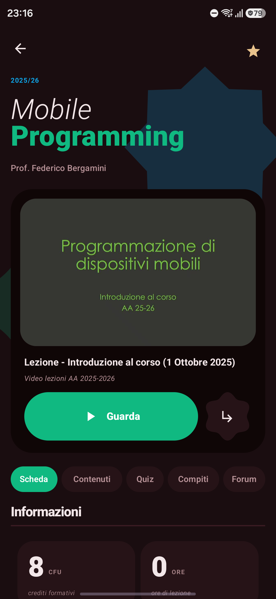</td>
<td>

#### Course detail

A collapsing header opens onto tabs for info, content, quizzes, assignments and forums, so the whole course lives behind one screen.

</td>
</tr>
<tr>
<td>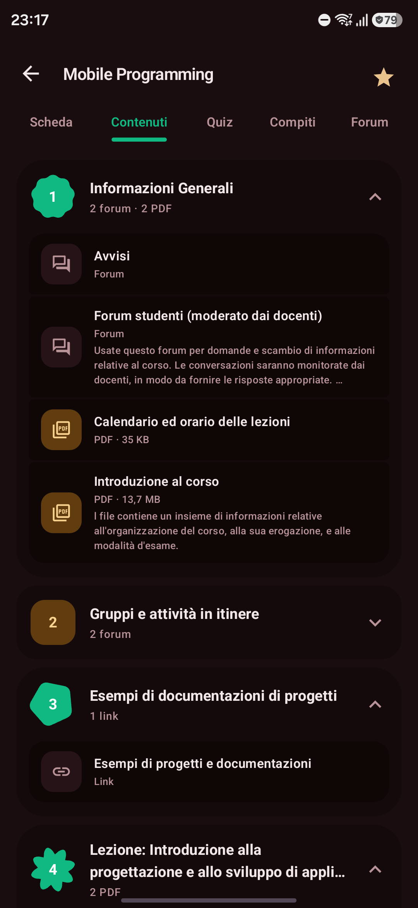</td>
<td>

#### Materials

Sections and folders expand inline, and an in‑app viewer opens PDFs, images and text without leaving the app. Office files hand off with a single tap.

</td>
</tr>
<tr>
<td>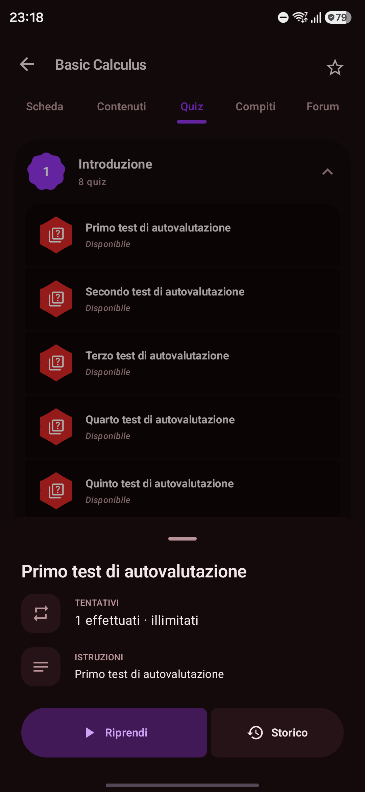</td>
<td>

#### Quizzes

Review past attempts, resume one in progress, and read your results and feedback question by question.

</td>
</tr>
<tr>
<td>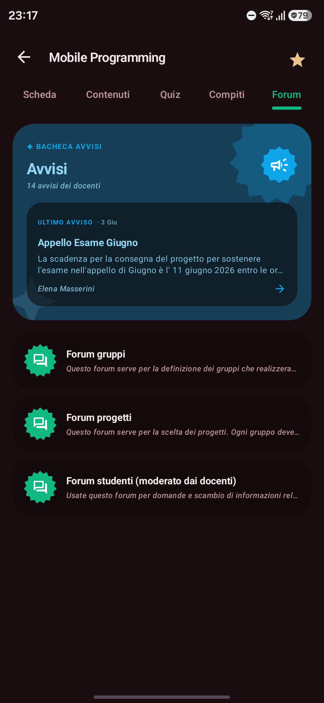</td>
<td>

#### Forums

Read announcements and discussions, reply, attach files and manage your subscriptions. Just like the web, but native.

</td>
</tr>
<tr>
<td>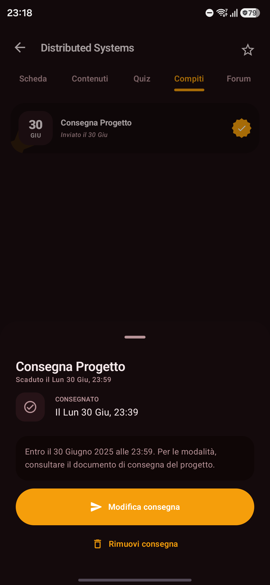</td>
<td>

#### Assignments

Read the brief, upload your files and submit, then track submission status, teacher feedback and your grade.

</td>
</tr>
</table>

Lecture recordings stream in‑app (Kaltura / HLS), alongside grades and module deadlines.

---

## 🗺️ Maps

The whole campus, offline. Buildings and rooms render from a bundled Protomaps vector
tileset on a MapLibre engine (**no Google Maps key, no network needed**) and the map
recolours itself to match your chosen theme.

<table>
<tr>
<td></td>
<td>

#### Offline campus map

Tappable pins for every building, rendered from a bundled vector tileset. No Google Maps key, no network needed.

</td>
</tr>
<tr>
<td>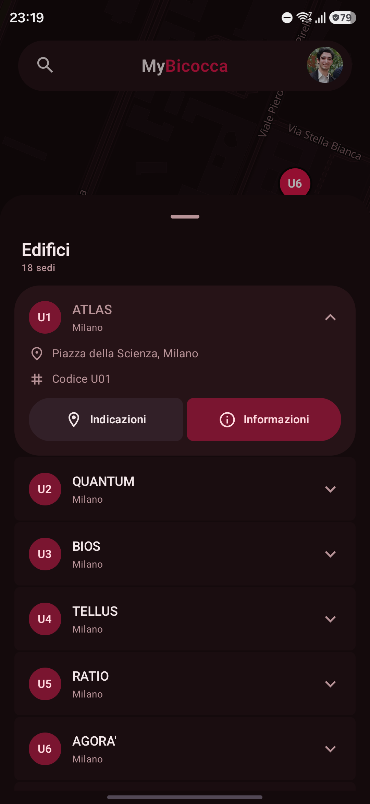</td>
<td>

#### Building directory

Search the whole campus, filter by category, and get one‑tap directions to anywhere.

</td>
</tr>
<tr>
<td>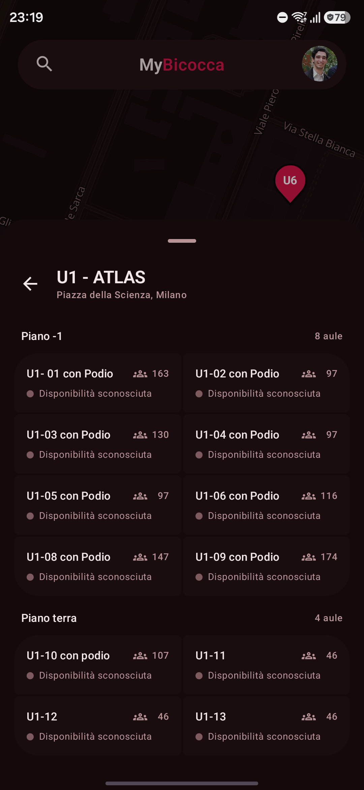</td>
<td>

#### Inside a building

Drill into rooms and their details, with live EasyBadge occupancy schedules. The map recolours itself to match your theme.

</td>
</tr>
</table>

---

## 🗂️ Services

The registry tab fans out into the full Esse3 toolbox: every student service you'd
otherwise hunt for online, grouped into Teaching, Bookings, Documents and Payments,
and topped by a deadlines banner that always shows what's next.

<table>
<tr>
<td></td>
<td>

#### The services hub

Home to everything administrative, grouped into Teaching, Bookings, Documents and Payments, and topped by a live deadlines banner.

</td>
</tr>
<tr>
<td>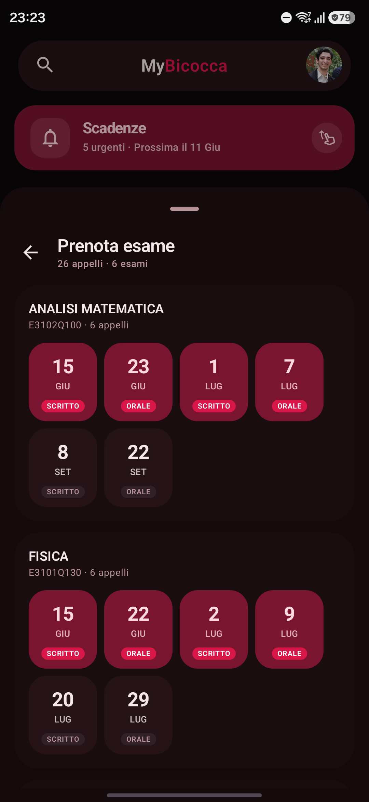</td>
<td>

#### Exam sessions

Browse every open exam call (appello) and book your seat in a single tap, with a confirmation you can show on the day.

</td>
</tr>
<tr>
<td>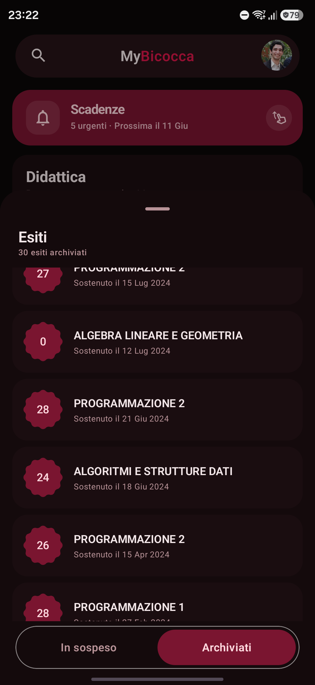</td>
<td>

#### Results

Published grades appear the moment they land, and you can accept or reject each one right from the list.

</td>
</tr>
<tr>
<td>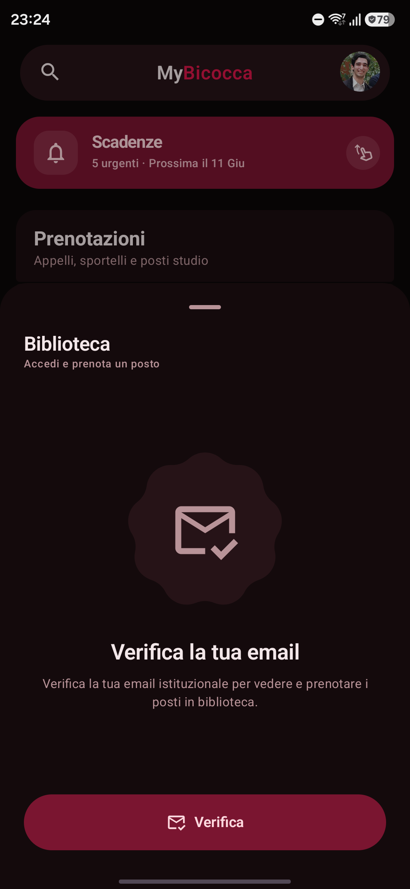</td>
<td>

#### Library seats

Reserve a study seat in the campus libraries, powered by Affluences, and manage the booking from the calendar.

</td>
</tr>
<tr>
<td>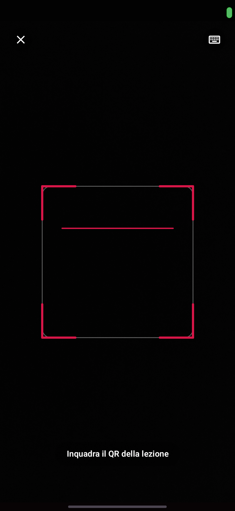</td>
<td>

#### Attendance

Mark yourself present by scanning the lecture's QR code. No paper sheet to chase.

</td>
</tr>
<tr>
<td>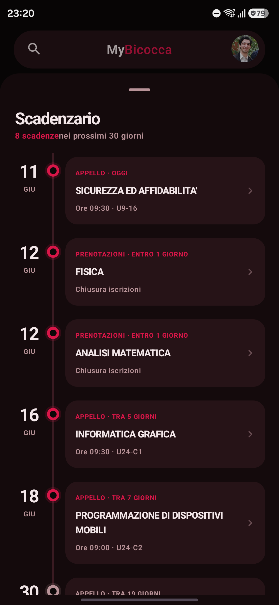</td>
<td>

#### Deadlines

A banner counts what's urgent and expands into a full chronological timeline of tuition, enrolment and exam dates.

</td>
</tr>
</table>

And the rest of the registry too: tuition and MAV/PagoPA payments, ISEE, refunds, certificates,
academic titles, enrolment records, study‑plan editing, questionnaires and segreteria appointments.

---

## 👤 Profile & career

A live dashboard of your academic standing: a flippable student card, your headline
stats, a grade‑trend chart, and a simulator that answers _"what grade do I need?"_.

<table>
<tr>
<td></td>
<td>

#### Student card & stats

A flippable student card up top, then your headline numbers: arithmetic and weighted average, exams passed and credits earned.

</td>
</tr>
<tr>
<td>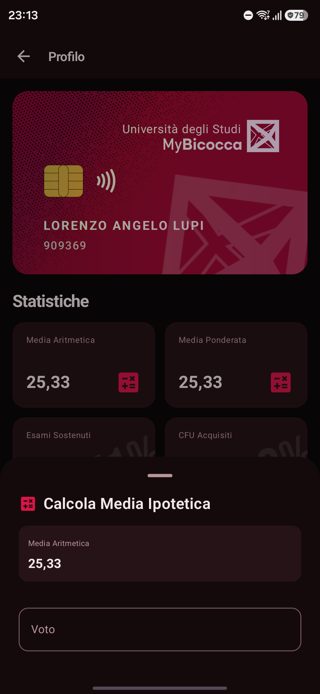</td>
<td>

#### Grade simulator

A "what‑if" calculator that shows how the next exam moves your average, in both arithmetic and weighted modes.

</td>
</tr>
<tr>
<td>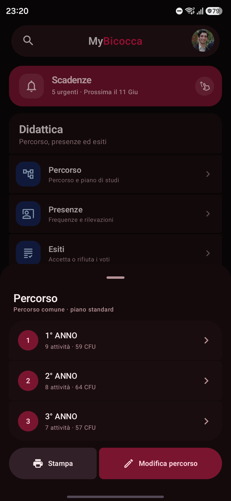</td>
<td>

#### Career

Your full libretto with a grade‑trend chart across the whole degree, broken down year by year.

</td>
</tr>
</table>

---

## 🙏 Acknowledgments

- [University of Milano‑Bicocca](https://www.unimib.it/) for the digital services
- [CINECA](https://www.cineca.it/) for the Esse3 platform
- [Moodle](https://moodle.org/) for the e‑learning platform
- [EasyStaff](https://www.easystaff.it/) for the scheduling system
- [Affluences](https://www.affluences.com/) for library seat booking

---

## 📄 License

Released under the [MIT License](LICENSE) © 2025 Alessandro Autiero, Federico Giarrusso, Lorenzo Angelo Lupi, Alessandro Ferrari.

 
Made with ❤️ by Bicocca students, for Bicocca students.

